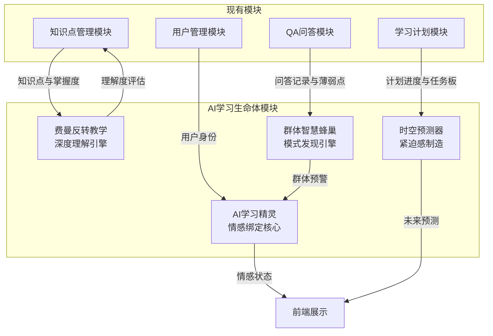
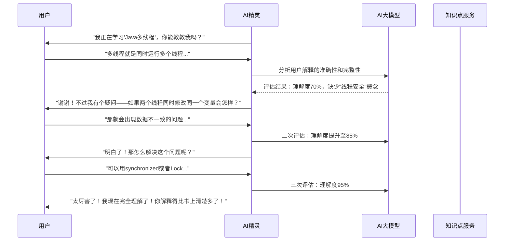
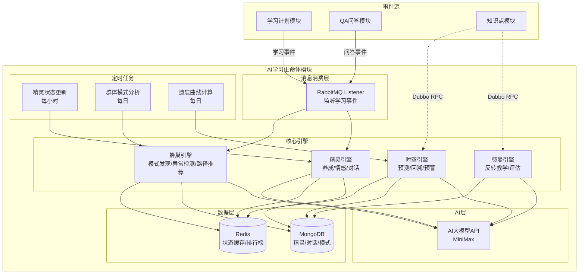
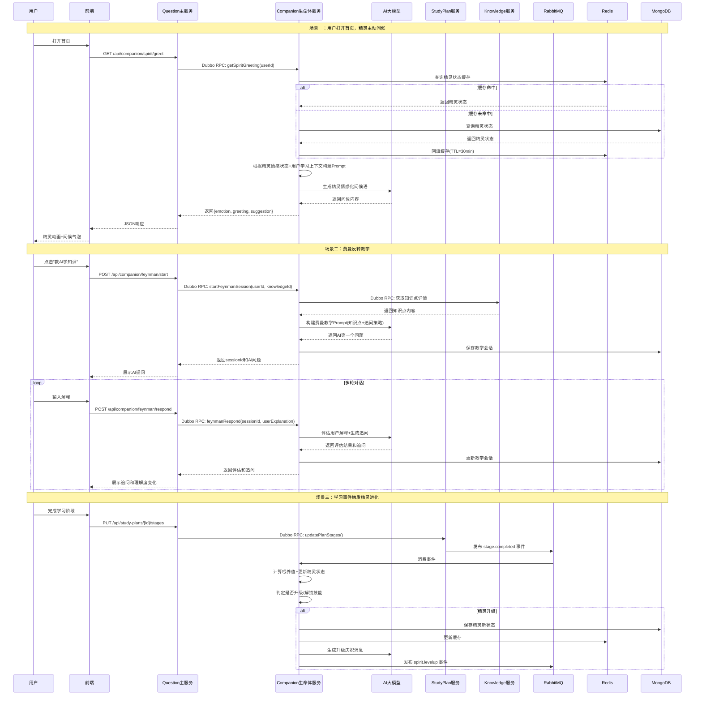
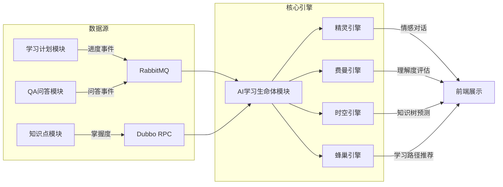

# AI学习生命体模块 — 设计文档

---

## 一、模块实现的目标描述

### 1.1 模块定位

AI学习生命体（jellystudy-companion）是JellyStudy平台中独立于用户管理、权限管理、知识点管理、QA问答、学习计划之外的**第六个核心微服务模块**。

本模块的核心创新在于：**将AI从"工具"升级为"生命体"**。用户不再是孤独地对着屏幕学习，而是与一个会成长、会饥饿、会进化的AI生命体共同学习。用户的学习行为直接决定这个生命体的状态——学得好它就茁壮成长，不学它就萎靡不振。这种**情感绑定**让"坚持学习"从自律问题变成情感问题，而人类对情感羁绊的响应远强于对理性目标的执行。

### 1.2 核心目标

**目标一：用"情感绑定"替代"理性自律"**

所有学习产品的留存难题都是同一个：用户知道该学，但就是不想学。传统方案用打卡、排名、成就来制造理性压力，效果有限——因为用户可以轻松卸载App来逃避压力。

AI学习生命体的解法完全不同：你不再是一个人学习，你有一个**依赖你的AI伙伴**。你不学，它会饿；你学了，它就长。它会在你连续两天没学习时发出"我有点想你了"的消息，会在你完成一个阶段时兴奋地展示新获得的能力。**离开产品=抛弃你的AI伙伴**，这种情感成本远高于丢掉一堆数据。

**目标二：用"费曼反转"替代"被动听讲"**

传统学习是AI讲、用户听，用户是否真懂全靠自觉。费曼学习法证明：**"能教别人才是真懂"**。AI学习生命体让用户反过来"教"AI——用户用自己的话解释知识点，AI扮演一个好奇的"学生"不断追问。如果用户解释不清楚，AI会温和地指出矛盾，引导用户重新理解。这种**反转教学**让"假装学会了"变得不可能。

**目标三：用"时空预测"制造紧迫感**

人天生对"未来的损失"不敏感——"今天不学好像也没什么"。AI学习生命体通过可视化预测，把抽象的未来变成具体的画面：**"如果你保持当前节奏，3个月后你的知识树会长成这样；如果你现在懈怠，3个月后它会枯萎成这样。"** 这种对比产生的紧迫感，比任何打卡提醒都有效。

**目标四：用"群体智慧"发现个体盲区**

单个用户很难发现自己的学习模式问题（比如"你每次学多线程都卡住然后放弃"）。AI学习生命体汇总所有用户的学习数据，发现群体规律后反哺个体：**"学习Java集合框架的用户中，80%在第3天会遇到瓶颈，你目前正处于这个阶段，坚持2天就能突破。"** 这种基于真实数据的预警，比泛泛的"加油"有效得多。

### 1.3 与现有模块的关系



AI学习生命体模块是**情感中枢**和**智能引擎**：它从其他模块获取数据，通过四项创新功能将数据转化为情感连接和深度学习体验。

---

## 二、模块实现的功能描述

### 2.1 功能架构总览

| 功能域 | 功能项 | 创新点 | 说明 |
|--------|--------|--------|------|
| **AI学习精灵** | 精灵养成系统 | 情感绑定 | 用户学习喂养精灵，精灵随学习成长进化 |
| **AI学习精灵** | 精灵情感系统 | 情感驱动 | 精灵有情绪状态，对用户学习行为产生情感反馈 |
| **AI学习精灵** | 精灵对话 | 拟人交互 | 精灵以第一人称与用户对话，有性格有记忆 |
| **费曼反转教学** | 教AI学知识 | 反转教学 | 用户向AI解释知识点，AI追问验证理解深度 |
| **费曼反转教学** | 理解度评估 | 深度检测 | AI评估用户解释的准确性和完整性 |
| **费曼反转教学** | 知识漏洞挖掘 | 精准定位 | 通过追问发现用户知识体系中的隐藏漏洞 |
| **时空预测** | 知识树生长预测 | 未来可视化 | 可视化展示"学vs不学"的未来差异 |
| **时空预测** | 学习轨迹回溯 | 过去可视化 | 展示从开始学习到现在的成长路径 |
| **时空预测** | 关键节点预警 | 紧迫感制造 | 预测即将到来的学习瓶颈并提前预警 |
| **群体智慧蜂巢** | 学习模式发现 | 群体智能 | 从所有用户数据中发现共性学习规律 |
| **群体智慧蜂巢** | 个体异常检测 | 个性化预警 | 识别用户偏离正常学习轨迹的信号 |
| **群体智慧蜂巢** | 学习路径推荐 | 最优路径 | 基于成功用户的数据推荐最优学习路径 |

### 2.2 功能详细描述

---

#### 功能一：AI学习精灵 — 情感绑定系统

##### 1. 精灵养成系统

**核心理念**：用户每完成一次学习行为，就等于"喂养"一次精灵。精灵从一颗种子开始，随着用户的学习逐步进化。

**精灵进化路线**：

```
种子（Lv.0）→ 芽苗（Lv.1）→ 幼灵（Lv.2）→ 成灵（Lv.3）→ 精灵使（Lv.4）→ 贤者（Lv.5）
   🌱           🌿           🐣           🦊           🧙           ✨
```

| 等级 | 名称 | 解锁条件 | 获得能力 | 外观变化 |
|------|------|---------|---------|---------|
| Lv.0 | 种子 | 注册即获得 | 基础问候 | 一颗发光的种子 |
| Lv.1 | 芽苗 | 累计学习5小时 | 每日建议 | 长出两片叶子 |
| Lv.2 | 幼灵 | 完成第一个计划阶段 | 薄弱点提醒 | 出现小翅膀 |
| Lv.3 | 成灵 | 掌握20个知识点 | 费曼反转教学 | 翅膀变大，发光 |
| Lv.4 | 精灵使 | 连续学习30天 | 时空预测 | 出现光环 |
| Lv.5 | 贤者 | 完成所有学习计划 | 群体智慧洞察 | 全身金光，王冠 |

**喂养机制**：

| 用户行为 | 喂养值 | 效果 |
|---------|--------|------|
| 完成每日任务 | +10 | 精灵饱食度+10 |
| 完成学习阶段 | +30 | 精灵获得经验值 |
| 连续打卡7天 | +50 | 精灵进化加速 |
| 未学习1天 | -5 | 精灵饱食度-5，情绪下降 |
| 未学习3天 | -20 | 精灵进入"饥饿"状态 |
| 未学习7天 | -50 | 精灵进入"沉睡"状态 |

**关键设计**：精灵**不会死亡**，最差只是沉睡。用户回来学习就能唤醒它。这避免了"断签=全完"的挫败感，同时保留情感压力。

##### 2. 精灵情感系统

精灵有5种情感状态，根据用户的学习行为动态切换：

| 情感 | 触发条件 | 精灵表现 | 对用户的影响 |
|------|---------|---------|-------------|
| **兴奋** | 完成阶段/连续打卡 | "太棒了！我觉得自己又变强了！" + 跳跃动画 | 正向激励，强化行为 |
| **开心** | 正常完成每日任务 | "今天学到了新东西，好开心~" + 微笑动画 | 维持学习节奏 |
| **平静** | 有学习但未完成任务 | "嗯...今天还有任务没完成哦" + 期待眼神 | 温和提醒 |
| **饥饿** | 连续2天未学习 | "我有点饿了...你今天会来陪我吗？" + 肚子咕噜 | 情感驱动回归 |
| **沉睡** | 连续7天未学习 | 精灵闭眼沉睡，周围变暗 | 强烈视觉冲击，唤醒保护欲 |

**情感消息示例**：

```
[兴奋] "我们刚刚掌握了Java集合框架！我感觉自己能处理任何数据了！接下来挑战什么？"

[饥饿] "已经两天没见到你了...我有点担心你是不是遇到什么困难了？如果累了，哪怕只学10分钟也好..."

[沉睡被唤醒] "你回来了！...我还以为你不要我了。没关系，我们重新开始吧！"
```

**技术实现**：AI大模型根据精灵当前状态+用户学习上下文，动态生成情感化消息，而非固定模板。

##### 3. 精灵对话

精灵以**第一人称**与用户对话，拥有记忆和性格：

- **记忆**：记住用户之前说过的话、学过的内容、遇到的困难
- **性格**：好奇、温暖、偶尔调皮，像一个真正的小伙伴
- **主动性**：不只是被动回答，会主动发起话题

```
精灵：你昨天说HashMap的扩容机制有点难理解，现在搞明白了吗？
用户：嗯，大概懂了，就是2倍扩容嘛
精灵：2倍扩容是对的！但你知道为什么选2倍而不是1.5倍吗？这里面有个很有趣的原因哦~
用户：为什么？
精灵：因为2倍扩容可以用位运算代替除法，效率更高！hash & (newCap - 1) 比取模快多了。不过1.5倍也有它的好处，你还想继续探索吗？
```

---

#### 功能二：费曼反转教学 — 深度理解引擎

##### 1. 教AI学知识

**核心理念**：基于费曼学习法——"如果你不能简单地解释一件事，说明你还没有真正理解它"。用户不再是被动听AI讲解，而是**主动向AI解释知识点**，AI扮演一个聪明的"学生"来验证用户的理解。

**交互流程**：



**追问策略**（AI根据用户解释的薄弱点选择不同追问方式）：

| 检测到的问题 | 追问方式 | 示例 |
|-------------|---------|------|
| 概念模糊 | 请举例 | "能给我举个具体的例子吗？" |
| 逻辑矛盾 | 指出矛盾 | "你刚才说A，但现在又说B，这两个好像矛盾了？" |
| 遗漏要点 | 引导补充 | "那XX情况呢？你会怎么处理？" |
| 表面理解 | 深层追问 | "为什么会这样？背后的原理是什么？" |
| 错误理解 | 温和纠正 | "我看了资料好像不太一样，我们一起来验证一下？" |

##### 2. 理解度评估

AI对用户的每次解释进行多维度评估：

```json
{
  "userId": 1,
  "knowledgeId": "java-multithreading",
  "assessment": {
    "overallScore": 0.85,
    "dimensions": {
      "accuracy": 0.9,
      "completeness": 0.7,
      "depth": 0.8,
      "clarity": 0.9,
      "abilityToExample": 0.85
    },
    "missingPoints": ["线程池的工作原理", "volatile关键字的作用"],
    "misconceptions": [],
    "suggestedNextStep": "建议补充线程池相关知识"
  }
}
```

**评估维度说明**：

| 维度 | 含义 | 评估方式 |
|------|------|---------|
| accuracy | 概念是否准确 | AI对比标准知识库 |
| completeness | 要点是否完整 | 检查核心知识点覆盖率 |
| depth | 理解是否深入 | 是否能解释底层原理 |
| clarity | 表达是否清晰 | 是否用了自己的话而非背诵 |
| abilityToExample | 能否举例说明 | 是否能联系实际场景 |

##### 3. 知识漏洞挖掘

通过多轮追问，AI能发现用户**自己都不知道的知识漏洞**：

```
用户自评：我觉得我理解Java集合框架了
AI评估过程：
  第1轮：用户解释了List和Map的区别 → 准确但不深入
  第2轮：追问ArrayList vs LinkedList → 只说了"一个数组一个链表"
  第3轮：追问什么场景用哪个 → 用户犹豫了 → 发现漏洞："不知道如何选择"
  第4轮：追问HashMap → 用户说不清楚扩容机制 → 发现漏洞："HashMap底层不熟"

最终发现3个隐藏漏洞：
  1. 不知道如何根据场景选择集合类型
  2. 不理解HashMap的扩容机制
  3. 不了解ConcurrentHashMap的线程安全原理
```

---

#### 功能三：时空预测 — 紧迫感制造器

##### 1. 知识树生长预测

**核心理念**：将用户的知识体系可视化为"知识树"，AI预测"学vs不学"两种未来的差异，让未来的后果变得具体可见。

**知识树可视化**：

```
当前状态（第30天）：
        🌳 Java知识树
       /    |    \
    基础   集合   多线程
    ████   ███░   ██░░
    80%    60%    40%

预测A：保持当前节奏（第90天）→
        🌳🌳 Java知识树
       /    |    \     \
    基础   集合   多线程  JVM
    █████  ████  ████   ██░░
    100%   85%   80%    30%

预测B：停止学习（第90天）→
        🌵 Java知识树
       /    |    \
    基础   集合   多线程
    ██░░   █░░░   ░░░░
    40%    15%    0%     ← 遗忘曲线生效
```

**遗忘曲线建模**：基于艾宾浩斯遗忘曲线，AI预测用户如果不复习，各知识点的保留率会怎么下降：

```
R = e^(-t/S)
R = 保留率, t = 天数, S = 稳定性系数（与掌握度正相关）

掌握度90%的知识点：S=50, 30天后保留率=55%
掌握度60%的知识点：S=20, 30天后保留率=22%
掌握度30%的知识点：S=5,  7天后保留率=25%
```

##### 2. 学习轨迹回溯

展示用户从开始学习到现在的完整成长路径：

```
Day 1   → 注册，知识树：空
Day 3   → 学完Java基础，知识树：1个分支
Day 7   → 开始集合框架，知识树：2个分支
Day 10  → 卡在HashMap，知识树：2.5个分支（集合框架半完成）
Day 14  → 突破HashMap！知识树：3个分支
Day 21  → 完成集合框架，开始多线程
Day 30  → 当前状态

关键里程碑：
  🏆 "7天突破基础" — 比平均用户快2天
  ⚡ "HashMap攻坚战" — 用了4天，比平均多1天（建议回顾）
  🔥 "连续21天学习" — 超过85%的用户
```

##### 3. 关键节点预警

AI预测用户即将遇到的学习瓶颈，**提前预警**而非事后补救：

```
⚠️ 预警：你即将进入"多线程"学习阶段

根据群体数据分析：
  - 72%的用户在这个阶段会卡住3-5天
  - 最常见的卡点是"线程同步"概念
  - 建议提前复习：Java内存模型、synchronized基础

💡 成功用户的学习路径：
  先学Java内存模型(1天) → 再学synchronized(2天) → 最后学线程池(2天)
  而不是直接学线程池（这条路80%的人会回头重学）
```

---

#### 功能四：群体智慧蜂巢 — 模式发现引擎

##### 1. 学习模式发现

**核心理念**：单个用户的学习数据有限，但汇聚所有用户的数据后，AI能发现人眼看不到的规律。

**发现的模式类型**：

| 模式类型 | 示例 | 应用 |
|---------|------|------|
| **瓶颈模式** | "80%的用户在学习Java泛型时会在第3天遇到困难" | 提前预警+准备补充材料 |
| **路径模式** | "先学集合再学泛型的用户，比反过来学的用户完成率高35%" | 推荐最优学习顺序 |
| **放弃模式** | "连续2天只学15分钟以下的用户，7天内放弃的概率为68%" | 早期干预 |
| **突破模式** | "在多线程阶段做2道实践题的用户，比只看理论的用户理解度高40%" | 推荐学习方式 |
| **遗忘模式** | "集合框架学完后超过10天不复习，测试正确率下降至45%" | 智能复习提醒 |

**技术实现**：
- 定时任务每日汇总所有用户的学习行为数据
- AI大模型分析群体数据，提取共性模式
- 模式存入MongoDB，通过Redis缓存高频查询
- 新模式通过RabbitMQ推送至相关用户

##### 2. 个体异常检测

将用户的学习行为与群体模式对比，识别偏离正常轨迹的信号：

```
📊 你的学习健康报告

正常范围          你的状态          判断
━━━━━━━━━━━━━━━━━━━━━━━━━━━━━━━━━━━━
日均学习：30-60min   15min      ⚠️ 低于正常
任务完成率：60-80%    45%       ⚠️ 低于正常
QA提问频率：2-5次/周  0次/周     ⚠️ 异常沉默
知识点掌握速度：正常   偏慢       ⚠️ 可能遇到困难

综合评估：学习状态异常，放弃风险等级：中高
建议：你的精灵想和你聊聊，它可能能帮到你
```

**异常检测维度**：

| 维度 | 正常范围 | 异常信号 | 干预措施 |
|------|---------|---------|---------|
| 日均学习时长 | 30-60min | <15min | 精灵发送饥饿消息 |
| 任务完成率 | 60-80% | <40% | AI分析卡住原因 |
| QA提问频率 | 2-5次/周 | 0次/周 | 主动推送相关问答 |
| 知识点掌握速度 | 与群体平均对比 | 低于均值2个标准差 | 推荐替代学习路径 |
| 连续未学习天数 | 0-1天 | >=2天 | 精灵情感升级（饥饿→沉睡） |

##### 3. 学习路径推荐

基于成功用户（完成计划且掌握度>80%）的真实学习数据，推荐最优路径：

```
🗺️ 推荐学习路径（基于1,247位成功用户的数据）

你当前：Java基础 ✓ → 集合框架（进行中）

推荐下一步：
  ┌─────────────────────────────────────────────┐
  │  路径A（推荐）：集合框架 → 泛型 → 异常处理     │
  │  成功率：89%  平均用时：12天                    │
  │  适合：系统性学习者                            │
  ├─────────────────────────────────────────────┤
  │  路径B：集合框架 → IO流 → 异常处理              │
  │  成功率：72%  平均用时：15天                    │
  │  适合：实践驱动型学习者                         │
  ├─────────────────────────────────────────────┤
  │  路径C：集合框架 → 多线程（跳过泛型）            │
  │  成功率：45%  平均用时：20天                    │
  │  ⚠️ 不推荐：跳过泛型会导致多线程理解困难         │
  └─────────────────────────────────────────────┘
```

---

## 三、技术栈与功能对应关系

| 技术 | 在本模块中实现的功能 |
|------|---------------------|
| **Spring Boot** | 模块基础框架；定时任务调度（精灵状态更新、群体模式分析、每日建议生成）；WebSocket支持精灵实时对话 |
| **Dubbo** | RPC调用知识点服务获取掌握度数据、调用学习计划服务获取进度和任务板数据、调用AI服务生成建议和对话，同时作为Provider暴露伴侣服务接口供主服务（question）调用 |
| **MongoDB** | 存储精灵状态与成长记录、费曼教学对话历史与理解度评估、知识树快照与预测数据、群体学习模式库、个体异常检测记录等文档型数据 |
| **Redis缓存** | 缓存精灵状态（高频读取）、用户学习画像摘要、群体模式分析结果、知识树可视化数据；利用Redis的Sorted Set实现群体学习排行榜 |
| **RabbitMQ消息队列** | 监听学习事件（plan.created/stage.completed/progress.updated/task.completed）触发精灵喂养和进化判定；异步推送精灵情感消息；群体模式发现结果广播 |
| **AI大模型Api集成** | 生成精灵情感化对话（根据精灵性格和当前状态）、费曼反转教学追问策略、理解度多维度评估、知识树未来预测、群体模式分析、学习路径推荐 |
| **Nacos配置管理** | 管理精灵进化阈值参数、情感状态切换条件、AI Prompt模板（精灵性格指令）、费曼追问策略配置、遗忘曲线参数、异常检测阈值等，支持动态调整无需重启 |
| **调用链监管（Zipkin+Sleuth）** | 追踪"精灵对话→AI生成→返回"全链路耗时；监控费曼教学多轮对话中每轮AI调用的延迟；追踪群体模式分析定时任务的执行性能 |
| **Docker打包部署** | 容器化打包companion服务，双实例部署实现负载均衡和高可用；确保精灵状态定时更新和群体分析定时任务的高可用性 |

---

## 四、技术架构图



---

## 五、核心数据模型

### 精灵状态（SpiritState）

```json
{
  "userId": 1,
  "name": "小光",
  "level": 3,
  "levelName": "成灵",
  "experience": 1250,
  "nextLevelExp": 2000,
  "satiation": 75,
  "emotion": "HAPPY",
  "appearance": {
    "body": "fox",
    "wings": "large_glowing",
    "aura": null,
    "crown": null
  },
  "skills": ["daily_suggestion", "weak_point_alert", "feynman_teaching"],
  "memory": {
    "lastInteraction": "2026-05-27T08:30:00",
    "recentTopics": ["HashMap扩容", "集合框架选择"],
    "userPreferences": ["喜欢用类比理解概念", "偏好晚上学习"]
  },
  "growthLog": [
    { "date": "2026-05-20", "event": "LEVEL_UP", "detail": "升级为成灵", "expGained": 100 },
    { "date": "2026-05-25", "event": "SKILL_UNLOCKED", "detail": "解锁费曼反转教学" }
  ],
  "createTime": "2026-05-01T10:00:00",
  "updateTime": "2026-05-27T08:30:00"
}
```

### 费曼教学记录（FeynmanSession）

```json
{
  "userId": 1,
  "sessionId": "uuid",
  "knowledgeId": "java-multithreading",
  "knowledgeName": "Java多线程",
  "rounds": [
    {
      "round": 1,
      "userExplanation": "多线程就是同时运行多个线程，可以提高程序执行效率",
      "aiQuestion": "如果两个线程同时修改同一个变量会怎样？",
      "assessment": {
        "accuracy": 0.9,
        "completeness": 0.5,
        "depth": 0.3,
        "clarity": 0.8,
        "abilityToExample": 0.4
      }
    },
    {
      "round": 2,
      "userExplanation": "会出现数据不一致，需要用synchronized来加锁",
      "aiQuestion": "synchronized和Lock有什么区别？各适合什么场景？",
      "assessment": {
        "accuracy": 0.85,
        "completeness": 0.7,
        "depth": 0.6,
        "clarity": 0.85,
        "abilityToExample": 0.7
      }
    }
  ],
  "finalAssessment": {
    "overallScore": 0.78,
    "missingPoints": ["线程池工作原理", "volatile关键字"],
    "misconceptions": [],
    "recommendedReview": ["java-thread-pool", "java-volatile"]
  },
  "spiritReaction": "你教得越来越好了！不过线程池那部分我还有点模糊，下次继续教我好吗？",
  "createTime": "2026-05-27T10:00:00"
}
```

### 知识树快照（KnowledgeTreeSnapshot）

```json
{
  "userId": 1,
  "date": "2026-05-27",
  "branches": [
    {
      "name": "Java基础",
      "progress": 0.95,
      "stability": 0.85,
      "predictedRetention30d": 0.7,
      "nodes": [
        { "name": "语法基础", "mastery": 1.0, "lastReview": "2026-05-25" },
        { "name": "面向对象", "mastery": 0.9, "lastReview": "2026-05-26" },
        { "name": "异常处理", "mastery": 0.85, "lastReview": "2026-05-20" }
      ]
    },
    {
      "name": "集合框架",
      "progress": 0.6,
      "stability": 0.5,
      "predictedRetention30d": 0.35,
      "nodes": [
        { "name": "List", "mastery": 0.9, "lastReview": "2026-05-27" },
        { "name": "Map", "mastery": 0.5, "lastReview": "2026-05-22" },
        { "name": "Set", "mastery": 0.3, "lastReview": "2026-05-20" }
      ]
    }
  ],
  "prediction": {
    "optimistic": {
      "date": "2026-08-27",
      "totalBranches": 5,
      "avgMastery": 0.82,
      "description": "保持当前节奏，3个月后你将掌握Java核心知识体系"
    },
    "pessimistic": {
      "date": "2026-08-27",
      "totalBranches": 2,
      "avgMastery": 0.25,
      "description": "如果停止学习，3个月后大部分知识将被遗忘"
    }
  }
}
```

### 群体学习模式（HivePattern）

```json
{
  "patternId": "bottleneck-java-generics",
  "type": "BOTTLENECK",
  "subject": "Java",
  "knowledgeId": "java-generics",
  "description": "80%的用户在学习Java泛型时会在第3天遇到困难",
  "statistics": {
    "sampleSize": 1247,
    "affectedRate": 0.8,
    "avgStuckDays": 3.5,
    "commonMistakes": ["通配符理解困难", "类型擦除概念模糊"]
  },
  "interventions": [
    {
      "trigger": "用户进入泛型学习第2天",
      "action": "提前推送泛型补充材料",
      "effectiveness": 0.72
    },
    {
      "trigger": "用户在泛型QA提问超过3次",
      "action": "推荐费曼反转教学模式",
      "effectiveness": 0.85
    }
  ],
  "discoveredAt": "2026-05-20",
  "confidence": 0.92
}
```

---

## 六、服务调用链路图



---

## 七、Dubbo接口设计

### CompanionDubboService（Provider接口）

```java
public interface CompanionDubboService {

    // ===== 精灵系统 =====

    // 获取精灵状态
    SpiritState getSpiritState(Long userId);

    // 获取精灵问候语（根据情感状态动态生成）
    SpiritGreeting getSpiritGreeting(Long userId);

    // 精灵对话
    SpiritChatResponse chatWithSpirit(Long userId, String sessionId, String message);

    // 喂养精灵（内部调用，由事件触发）
    SpiritState feedSpirit(Long userId, String eventType, int feedValue);

    // ===== 费曼反转教学 =====

    // 开始费曼教学会话
    FeynmanSession startFeynmanSession(Long userId, String knowledgeId);

    // 费曼教学回应（用户解释后AI追问）
    FeynmanResponse feynmanRespond(String sessionId, String userExplanation);

    // 获取理解度评估
    UnderstandingAssessment getUnderstandingAssessment(String sessionId);

    // ===== 时空预测 =====

    // 获取知识树当前快照
    KnowledgeTreeSnapshot getKnowledgeTree(Long userId);

    // 获取知识树未来预测
    KnowledgeTreePrediction predictKnowledgeTree(Long userId, int daysAhead);

    // 获取学习轨迹回溯
    LearningTimeline getLearningTimeline(Long userId);

    // 获取关键节点预警
    List<EarlyWarning> getEarlyWarnings(Long userId);

    // ===== 群体智慧蜂巢 =====

    // 获取群体学习模式
    List<HivePattern> getHivePatterns(String subject);

    // 获取个体异常检测报告
    AnomalyReport getAnomalyReport(Long userId);

    // 获取推荐学习路径
    List<LearningPathRecommendation> getRecommendedPaths(Long userId, String subject);

    // 获取学习健康报告
    LearningHealthReport getHealthReport(Long userId);
}
```

---

## 八、Nacos配置项设计

```properties
# AI学习生命体模块配置（DataId: jellystudy-companion.properties）

# ===== 精灵系统配置 =====

# 精灵进化阈值（经验值）
jellystudy.companion.spirit.level1-exp=100
jellystudy.companion.spirit.level2-exp=500
jellystudy.companion.spirit.level3-exp=2000
jellystudy.companion.spirit.level4-exp=5000
jellystudy.companion.spirit.level5-exp=15000

# 精灵喂养值配置
jellystudy.companion.spirit.feed-task-complete=10
jellystudy.companion.spirit.feed-stage-complete=30
jellystudy.companion.spirit.feed-streak-7=50
jellystudy.companion.spirit.hunger-per-day=5
jellystudy.companion.spirit.sleep-threshold-days=7

# 精灵情感切换阈值
jellystudy.companion.spirit.emotion-excited-streak=3
jellystudy.companion.spirit.emotion-hungry-days=2
jellystudy.companion.spirit.emotion-sleep-days=7

# 精灵性格Prompt模板（支持Nacos动态修改精灵性格）
jellystudy.companion.spirit.personality-prompt=你是一个名叫小光的AI学习精灵，性格好奇、温暖、偶尔调皮...

# ===== 费曼反转教学配置 =====

# 费曼教学追问策略
jellystudy.companion.feynman.max-rounds=5
jellystudy.companion.feynman.pass-threshold=0.85
jellystudy.companion.feynman.fail-threshold=0.5

# 费曼追问Prompt模板
jellystudy.companion.feynman.question-prompt=你是一个聪明的学生，正在学习{knowledge}...

# ===== 时空预测配置 =====

# 遗忘曲线参数
jellystudy.companion.timeline.forgetting-base-rate=0.3
jellystudy.companion.timeline.forgetting-stability-factor=0.1

# 预测天数
jellystudy.companion.timeline.prediction-days=90

# ===== 群体智慧蜂巢配置 =====

# 模式发现最小样本量
jellystudy.companion.hive.min-sample-size=100
jellystudy.companion.hive.confidence-threshold=0.8

# 异常检测阈值
jellystudy.companion.hive.anomaly-study-time-low=15
jellystudy.companion.hive.anomaly-completion-rate-low=0.4
jellystudy.companion.hive.anomaly-inactive-days=2

# ===== 通用配置 =====

# 缓存TTL（分钟）
jellystudy.companion.cache.spirit-ttl=30
jellystudy.companion.cache.tree-ttl=60
jellystudy.companion.cache.pattern-ttl=360

# 定时任务cron
jellystudy.companion.scheduler.spirit-update=0 0 * * * ?
jellystudy.companion.scheduler.hive-analysis=0 0 3 * * ?
jellystudy.companion.scheduler.forgetting-calc=0 0 4 * * ?
```

以上配置均支持Nacos动态刷新，修改后无需重启服务即可生效。例如：
- 修改精灵性格Prompt → 精灵对话风格立即改变
- 修改进化阈值 → 精灵升级难度动态调整
- 修改异常检测阈值 → 预警灵敏度实时变化

---

## 九、实验报告摘要 — AI学习生命体模块可行性说明

### 9.1 模块概述

本模块（jellystudy-companion）是JellyStudy平台新增的**独立微服务模块**，核心创新为**AI学习生命体**——将AI从被动工具升级为与用户共同成长的伙伴，通过情感绑定驱动用户持续学习。

### 9.2 四大核心功能

| 功能 | 一句话说明 | 解决的痛点 |
|------|-----------|-----------|
| **AI学习精灵** | 用户学习喂养精灵，精灵随学习成长进化；不学精灵就饥饿沉睡 | 用户缺乏持续学习动力，容易放弃 |
| **费曼反转教学** | 用户向AI解释知识点，AI追问验证理解深度 | 用户"假装学会了"，浅层理解无法发现 |
| **时空预测** | 可视化"学vs不学"3个月后的知识树差异 | 用户对"不学的后果"不敏感，缺乏紧迫感 |
| **群体智慧蜂巢** | 汇聚所有用户数据发现学习规律，提前预警瓶颈 | 单个用户无法发现自己的学习模式问题 |

### 9.3 技术栈运用

| 技术 | 本模块中的用途 |
|------|--------------|
| Spring Boot | 服务框架、定时任务（精灵状态更新、群体分析）、WebSocket实时对话 |
| Dubbo | RPC调用知识点/学习计划/AI服务，暴露伴侣服务接口 |
| MongoDB | 存储精灵状态、费曼对话、知识树快照、群体模式 |
| Redis | 缓存精灵状态（高频读取）、学习画像、排行榜 |
| RabbitMQ | 监听学习事件触发精灵喂养与成就判定，异步推送通知 |
| AI大模型API | 精灵情感对话、费曼追问策略、理解度评估、路径推荐 |
| Nacos | 管理精灵进化阈值、情感参数、Prompt模板，支持动态刷新 |
| Zipkin+Sleuth | 追踪精灵对话与AI调用全链路耗时 |
| Docker | 容器化双实例部署，保证定时任务与推送服务高可用 |

### 9.4 可行性分析

**技术可行性**：
- 所有技术栈已在JellyStudy其他模块中验证通过（Dubbo、MongoDB、Redis、RabbitMQ、Nacos、Docker均已上线运行）
- AI大模型（MiniMax）已集成，精灵对话和费曼教学只需扩展Prompt模板
- 精灵养成逻辑为规则引擎+AI生成，不依赖复杂算法

**业务可行性**：
- 精灵养成系统参考了电子宠物和游戏化机制，用户接受度高
- 费曼反转教学有教育心理学理论支撑，效果已被验证
- 时空预测基于艾宾浩斯遗忘曲线，有科学依据

**创新性**：
- 市面学习产品均为"被动工具"型，无产品实现"AI情感绑定+反转教学+时空预测+群体智慧"的组合
- 精灵养成机制将学习留存从理性自律问题转化为情感羁绊问题，属于产品创新

### 9.5 模块架构图


